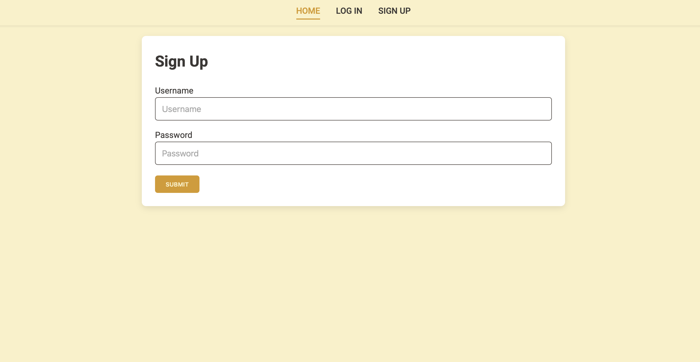

## To Do web app

This app can make task whit titles descripions and date in order to achive this task.
to build this app is bulid in flask an integer an sql database.

### how to build this app
#### Create databases
```sql
CREATE TABLE users (
    id INT PRIMARY KEY AUTO_INCREMENT,
    username VARCHAR(50) UNIQUE NOT NULL,
    password VARCHAR(100) NOT NULL
);

CREATE TABLE task (
    id INT PRIMARY KEY AUTO_INCREMENT,
    created_by INT NOT NULL,
    daydate TIMESTAMP NOT NULL DEFAULT CURRENT_TIMESTAMP,
    title VARCHAR(70) NOT NULL,
    descTask TEXT NOT NULL,
    state BOOLEAN NOT NULL,
    FOREIGN KEY (created_by) REFERENCES users (id)
);
```

---

## How it Looks


